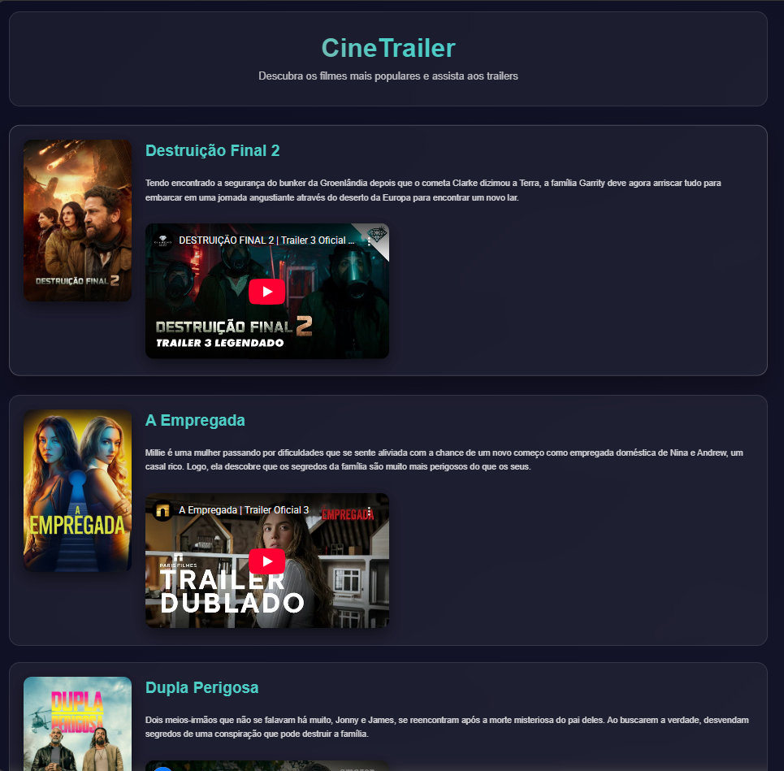

# 🎬 CineTrailer

> Catálogo de filmes populares com trailers integrados do YouTube


## 📋 Sobre o Projeto

**CineTrailer** é uma aplicação web moderna que consome a API do **The Movie Database (TMDB)** para exibir os filmes mais populares do momento. A aplicação apresenta informações detalhadas sobre cada filme e incorpora trailers do YouTube diretamente na interface, proporcionando uma experiência completa para os amantes de cinema.

## ✨ Funcionalidades

- 📺 **Listagem de Filmes Populares** - Exibe cards com os filmes mais assistidos e bem avaliados
- 🎥 **Trailers Integrados** - Reproduz trailers do YouTube sem sair da aplicação
- 🖼️ **Pôsteres em Alta Qualidade** - Imagens oficiais fornecidas pela TMDB
- 📝 **Sinopses Completas** - Descrição detalhada de cada filme
- 🌐 **Conteúdo em Português** - Todas as informações em pt-BR
- ⚡ **Loading State** - Feedback visual durante o carregamento

## 🛠️ Tecnologias

- **[React](https://react.dev/)** - Biblioteca JavaScript para interfaces de usuário
- **[Vite](https://vitejs.dev/)** - Build tool e dev server de alta performance
- **[Axios](https://axios-http.com/)** - Cliente HTTP para requisições à API
- **[TMDB API](https://www.themoviedb.org/documentation/api)** - Base de dados de filmes

## 🚀 Como Executar

### Pré-requisitos

- Node.js (versão 14 ou superior)
- npm ou yarn
- Conta na TMDB para obter uma API key

### Instalação

1. **Clone o repositório**

```bash
git clone https://github.com/seu-usuario/apiFilmes.git
cd apiFilmes
```

2. **Instale as dependências**

```bash
npm install
```

3. **Configure a API Key**

⚠️ Por questões de segurança, substitua a API key no arquivo `src/App.jsx` pela sua própria chave ou utilize variáveis de ambiente.

Exemplo no `src/App.jsx`:

```jsx
const API_KEY = 'sua chave_aqui'; // Substitua pela sua chave da API do TMDb
```

4. **Execute o projeto**

```bash
npm run dev
```

5. **Acesse no navegador**

```
http://localhost:5173
```

## 📜 Scripts Disponíveis

| Comando           | Descrição                                |
| ----------------- | ---------------------------------------- |
| `npm run dev`     | Inicia o servidor de desenvolvimento     |
| `npm run build`   | Cria a build otimizada para produção     |
| `npm run preview` | Visualiza a build de produção localmente |
| `npm run lint`    | Executa o ESLint para verificar o código |

## 📁 Estrutura do Projeto

```
apiFilmes/
├── public/             
├── src/
│   ├── assets/         
│   ├── App.jsx         # Componente principal
│   ├── App.css         # Estilos do componente App
│   ├── main.jsx        # Ponto de entrada
│   └── index.css       # Estilos globais
├── index.html          # HTML base
├── package.json        # Dependências e scripts
├── vite.config.js      # Configuração do Vite
└── eslint.config.js    # Configuração do ESLint
```

## 🔌 API do TMDB

Documentacao oficial: https://www.themoviedb.org/documentation/api

E necessario criar uma conta na TMDB para obter a sua API key.

A aplicação utiliza os seguintes endpoints:

- **GET** `/movie/popular` - Lista os filmes mais populares
- **GET** `/movie/{movie_id}/videos` - Busca trailers de cada filme

## 💡 Destaques Técnicos

- ⚛️ **React Hooks** - useState e useEffect para gerenciamento de estado
- 🔄 **Requisições Assíncronas** - async/await com Promise.all para paralelização
- 🎬 **Embeds do YouTube** - Integração com iframes configurados
- 🎨 **Renderização Condicional** - Loading states e fallbacks
- 🛡️ **Tratamento de Erros** - Try/catch em todas as requisições

## 📸 Preview



A interface apresenta:

- Header com título e descrição
- Grid responsiva de cards de filmes
- Cada card contém: pôster, título, sinopse e trailer

## 🔐 Segurança

⚠️ **Importante**: A API key está exposta no código. Para produção, considere:

- Usar variáveis de ambiente (`.env`)
- Implementar um backend proxy
- Configurar restrições de domínio na TMDB


## 📄 Licença

Este é um projeto educacional/demonstrativo.


## 👨‍💻 Autor: Elisson

Desenvolvido com  usando React + Vite

---

⭐ Se este projeto foi útil, considere dar uma estrela!
